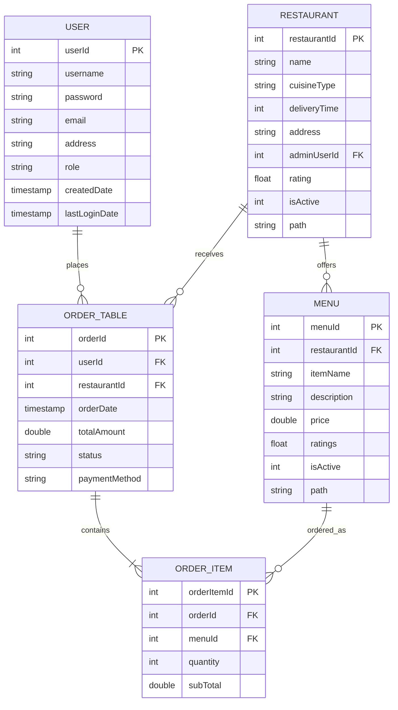
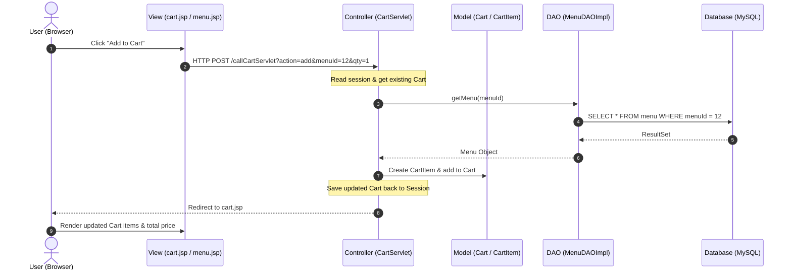

# FoodNest (Instant Food) Project Presentation Guide & Script

This guide is designed to help you present your **FoodNest (Instant Food)** project professionally. It is structured into a slide-by-slide presentation outline, a word-for-word voiceover script, screen demonstration actions, a technical deep-dive, and a Q&A preparation section.

---

## Part 1: Presentation Overview & Slides Structure

If you are using slides, here is the recommended structure. If you are doing a pure screen-recording, you can use these sections as your talking points.

| Slide # | Slide Title | Visual Elements | Core Message |
| :--- | :--- | :--- | :--- |
| **1** | **Title Slide** | Project Logo, Your Name, Tech Stack Icons (Java, MySQL, JS, Razorpay) | Introducing FoodNest: A modern, secure, and responsive food ordering platform. |
| **2** | **The Problem & Solution** | Bullet points of problems (clunky UI, insecure payments) vs. FoodNest solutions | Why we built this: to bridge the gap between local restaurants and users with a premium experience. |
| **3** | **System Architecture** | Block diagram of MVC (Model-View-Controller) architecture | How the system is organized using Java Servlets, JSPs, and JDBC. |
| **4** | **Database Design (ER)** | ER Diagram / Table List showing relationships (Users, Restaurants, Menus, Orders, OrderItems) | Relational database schema showing 1-to-many relationships and data integrity. |
| **5** | **Core Features** | Icons representing Auth, Cart, Razorpay, Order History | Highlighting the key functionalities that make the app production-ready. |
| **6** | **Technical Highlight: Razorpay** | Flowchart of the payment gateway integration (Frontend -> Gateway -> Backend) | Explaining how we secure transactions using Razorpay's checkout API. |
| **7** | **Live Demonstration** | (Transition to Web Browser) | Walking through a live user journey. |
| **8** | **Conclusion & Future Scope** | Bullet points (Stripe integration, Restaurant Dashboard, Live Tracking) | Wrapping up and talking about scalability. |

---

## Part 2: Voiceover & Screen Demo Script

*Use this script for your video narration. Adjust the tone to be confident, clear, and professional.*

### Section 1: Introduction (Duration: ~45 seconds)
* **Screen Action**: Show the **Login/Register** page or the **Restaurant Home** page. Move your mouse smoothly.
* **Voiceover**:
  > *"Hello everyone, and welcome. Today, I am excited to present **FoodNest**, a comprehensive, full-stack food ordering application. The goal of this project was to build a highly responsive, secure, and modern web application that connects users with local restaurants, allowing them to browse menus, manage a shopping cart, and place orders with real-time digital payment integration.*
  > 
  > *From a design perspective, we chose a premium dark-themed interface, utilizing harmonious color palettes, clear typography, and responsive grid layouts to provide an engaging user experience."*

---

### Section 2: Architecture & Technology Stack (Duration: ~1 minute)
* **Screen Action**: Show the project structure in your IDE (Eclipse/VS Code), highlighting the packages: `com.tap.Model`, `com.tap.Servlet`, `com.tap.DAO`, `com.tap.DAOImpl`.
* **Voiceover**:
  > *"Under the hood, FoodNest is built using the **Model-View-Controller (MVC)** architectural pattern, ensuring a clean separation of concerns:*
  > 
  > 1. *Our **View** layer is powered by dynamic **JSP (JavaServer Pages)** and styled with custom CSS, ensuring responsiveness across desktops and mobile devices.*
  > 2. *The **Controller** layer consists of **Java Servlets** that handle incoming HTTP requests, process business logic, and manage user sessions.*
  > 3. *The **Model** layer represents our data entities, which are mapped to a **MySQL relational database**.*
  > 
  > *To interact with the database, we implemented the **DAO (Data Access Object) Design Pattern**. This decouples our business logic from the database code. We establish database connections efficiently using a centralized [DBConnection](file:///c:/Users/Lenovo/AdvanceJava/Instant_Food/src/main/java/com/tap/utility/DBConnection.java) utility class running on a MySQL JDBC Driver."*

---

### Section 3: The Live User Journey (Duration: ~3 minutes)
*This is the most important part of the video. Keep your cursor movements slow and deliberate.*

#### Step 1: User Authentication
* **Screen Action**: Navigate to `register.html`, fill in mock details, click register. Then go to `login.html`, log in, and show the redirect to `/home`.
* **Voiceover**:
  > *"Let's start with the user journey. A new user can register securely on our platform. Once registered, they log in. The application validates their credentials against the database, creates an active HTTP session, and redirects them to our restaurant discovery page."*

#### Step 2: Browsing Restaurants & Menus
* **Screen Action**: Scroll through the `/home` page showing different restaurants. Hover over a card to show the micro-animations (scale/shadow). Click on a restaurant (e.g., "Burger House") to open `/menu`.
* **Voiceover**:
  > *"Here is the home dashboard. We fetch and display all active restaurants dynamically from the database. Each card displays the cuisine type, average delivery time, ratings, and a representative image.*
  > 
  > *Clicking on a restaurant triggers the [MenuServlet](file:///c:/Users/Lenovo/AdvanceJava/Instant_Food/src/main/java/com/tap/Servlet/MenuServlet.java), which retrieves all menu items associated with that specific restaurant ID. Users can see item names, descriptions, prices, and ratings."*

#### Step 3: Managing the Smart Cart
* **Screen Action**: Add 2 items to the cart. Go to `cart.jsp`. Increase the quantity of one item, then click update. Show the total price updating. 
* **Voiceover**:
  > *"Next, we have the shopping cart. When a user adds an item, the request is processed by our [CartServlet](file:///c:/Users/Lenovo/AdvanceJava/Instant_Food/src/main/java/com/tap/Servlet/CartServlet.java). The cart is stored in the user's session, meaning it persists as they navigate the site.*
  > 
  > *A key business rule we implemented is **single-restaurant ordering**. If a user has items from 'Restaurant A' in their cart and attempts to add an item from 'Restaurant B', the application automatically detects the conflict, resets the cart, and starts a new order. This prevents logistic conflicts during delivery. Users can also dynamically update quantities or remove items, with the subtotals recalculating instantly."*

#### Step 4: Checkout & Razorpay Payment Integration
* **Screen Action**: Click "Proceed to Checkout". Show `checkout.jsp`. Select **UPI / QR Code** or **Credit/Debit Card**. Click **Place Order**. Show the Razorpay checkout overlay appearing on screen. Perform a successful test payment. Show the redirect to `orderConfirmation.jsp`.
* **Voiceover**:
  > *"Now, let's proceed to checkout. The checkout page displays the recipient's information, shipping address, and order summary.*
  > 
  > *For payments, we integrated the **Razorpay Payment Gateway API**. If the user selects Cash on Delivery, the order is processed directly. However, if they select UPI or Card, our frontend JavaScript intercepts the submission and launches the secure Razorpay Checkout overlay.*
  > 
  > *Upon a successful transaction in the sandbox environment, Razorpay returns a unique payment ID. We inject this ID into our form and submit it to our [CheckoutServlet](file:///c:/Users/Lenovo/AdvanceJava/Instant_Food/src/main/java/com/tap/Servlet/CheckoutServlet.java). The servlet updates the order status to 'Paid', logs the transaction, clears the session cart, and redirects the user to this beautiful Order Confirmation page showing their generated Order ID."*

#### Step 5: Order History
* **Screen Action**: Click on "History" in the navbar to show `orderHistory.jsp`.
* **Voiceover**:
  > *"Finally, users can track their order history. The [OrderHistoryServlet](file:///c:/Users/Lenovo/AdvanceJava/Instant_Food/src/main/java/com/tap/Servlet/OrderHistoryServlet.java) fetches all past orders matching the logged-in user's ID, showing the date, total amount paid, payment method, and order status."*

---

### Section 4: Conclusion (Duration: ~30 seconds)
* **Screen Action**: Return to the IDE or a summary slide.
* **Voiceover**:
  > *"To summarize, FoodNest is a robust, production-ready web application demonstrating MVC architecture, secure session management, relational database integrity, and third-party API integration.*
  > 
  > *In the future, we plan to expand this project by adding a dedicated Restaurant Partner Dashboard, real-time delivery tracking using Google Maps API, and SMS notifications using Twilio.*
  > 
  > *Thank you for your time. I am now open to any questions you may have."*

---

## Part 3: Technical Deep-Dive

To explain the project "deeply," you must understand the relational database schema and how data flows through the system.

### 1. Relational Database Schema
Here is how your database tables are structured and how they relate to one another:

### 2. MVC Data Flow Diagram
This diagram shows how a request (e.g., adding an item to the cart) flows through your codebase:

---

## Part 4: Professional Q&A Preparation

Here are the most common questions examiners, interviewers, or clients will ask about a project like this, along with professional answers.

### Q1: Why did you use Servlets and JSP instead of modern frameworks like Spring Boot or React?
* **Answer**: 
  > *"I chose Servlets and JSP to build a strong foundation in **Core Java Web Development and Jakarta EE**. While frameworks like Spring Boot abstract many details, writing raw Servlets and JSPs helped me understand the HTTP request-response lifecycle, session tracking, and MVC architecture at a fundamental level. This deep understanding makes it much easier to transition to and troubleshoot enterprise-level frameworks like Spring Boot in the future."*

### Q2: How did you handle SQL injection and database connection leaks?
* **Answer**: 
  > *"To prevent SQL Injection, we exclusively used **`PreparedStatement`** instead of raw `Statement` for all parameterized queries. This ensures that user inputs are treated as literal values rather than executable SQL code.*
  > *To prevent connection leaks, our database operations utilize structured JDBC try-catch blocks. In a production environment, we would further optimize this by implementing a **Database Connection Pool (like HikariCP or Tomcat JDBC Pool)** to reuse connection objects rather than opening and closing a new connection for every request."*

### Q3: Explain the logic behind your Cart management. How does it handle multiple restaurants?
* **Answer**: 
  > *"The cart is managed as a Java object containing a `Map<Integer, CartItem>` and is stored in the user's `HttpSession`. To prevent logistics issues (like ordering from two different cities at the same time), we implemented a validation check in [CartServlet.java](file:///c:/Users/Lenovo/AdvanceJava/Instant_Food/src/main/java/com/tap/Servlet/CartServlet.java). When an item is added, we compare its `restaurantId` with the `restaurantId` currently stored in the session. If they mismatch, we instantiate a new `Cart` object, clearing the previous items, and update the session with the new restaurant's ID."*

### Q4: How secure is your Razorpay payment integration?
* **Answer**: 
  > *"Currently, we use the **Razorpay Standard Checkout** integration on the frontend. The frontend captures the payment, and on success, Razorpay returns a `razorpay_payment_id`. This ID is passed to our backend [CheckoutServlet.java](file:///c:/Users/Lenovo/AdvanceJava/Instant_Food/src/main/java/com/tap/Servlet/CheckoutServlet.java) where it is stored in the database. To make this fully production-secure, we would implement **Signature Verification** on the backend using the Razorpay Java SDK. This involves hashing the `order_id`, `payment_id`, and our secret key, and comparing it with the signature sent by Razorpay to verify that the payment was not tampered with."*

### Q5: How did you handle password security for users?
* **Answer**: 
  > *"In the current implementation, passwords are stored directly. However, in a production-grade application, storing plain text passwords is a security risk. The next step in securing the application would be to integrate a hashing algorithm like **BCrypt** to hash passwords with a salt before storing them in the database, and verifying the hashes during login."*

---

## Part 5: Tips for a Stellar Presentation Video

1. **Clean Screen environment**: Close unrelated browser tabs, hide your desktop icons, and use a high-quality microphone.
2. **Smooth Pacing**: Do not rush. Spend time showing the UI and explaining *why* a feature is designed that way, rather than just showing that it works.
3. **Show Code and UI Side-by-Side**: If possible, show a code snippet (like the Cart logic or Razorpay Javascript) and immediately show its effect in the browser. This demonstrates that you wrote the code and understand exactly how it connects to the user interface.
4. **Resolution**: Record in 1080p at 60fps. Make sure your IDE font size is large enough to be easily readable on mobile screens (14pt-16pt minimum).
